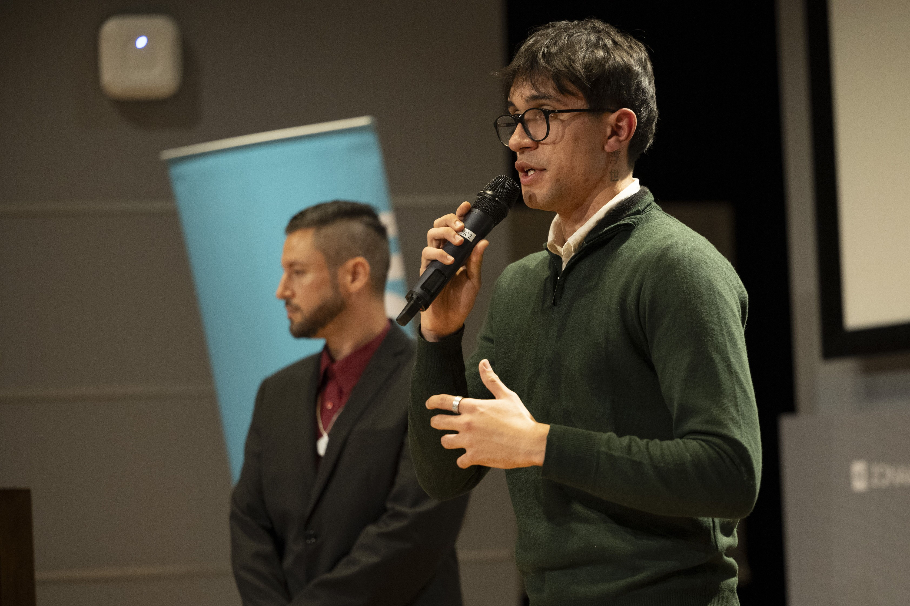

# 🖥️ Mi Portfolio

Bienvenido/a a mi portfolio personal. Aquí podrás encontrar información sobre mis proyectos, habilidades y experiencia en desarrollo de software.

## 📌 Sobre mi portfolio

En este espacio muestro algunos de mis trabajos, experiencias y conocimientos en el mundo del desarrollo. Mi objetivo es crear soluciones innovadoras y mejorar mis habilidades constantemente.

## 🚀 Proyectos destacados

Aquí algunos de los proyectos que puedes encontrar en mi portfolio:

### 🔹 CazaPalabras
📌 Juego estilo Wordle donde los usuarios deben encontrar palabras ocultas. Desarrollado con JavaScript vanilla, HTML5 y CSS3, implementando lógica de juego compleja y animaciones interactivas. Dicha aplicación es adaptada a celulares.
🔗 [Enlace al proyecto](https://santiagofleitasibarra.github.io/CazaPalabras-Juego-2025/)

### 🔹 IbaEduca
📌 Plataforma educativa para la venta de cursos en línea. Incluye sistema de gestión de contenido, reproducción de videos y procesamiento de pagos. Desarrollado en colaboración para ofrecer educación accesible y de calidad. Dicha aplicación es adaptada a celulares.

### 🔹 ENTRE OTROS!!!

## 📬 Contacto

Si deseas ponerte en contacto conmigo, puedes encontrarme en:

- 📧 Email: santiagofle8@gmail.com
- 🔗 LinkedIn: Santiago Mauricio Fleitas Ibarra 
- 💻 GitHub: SantiagoFleitasIbarra

---

✨ ¡Gracias por visitar mi portfolio! ✨
